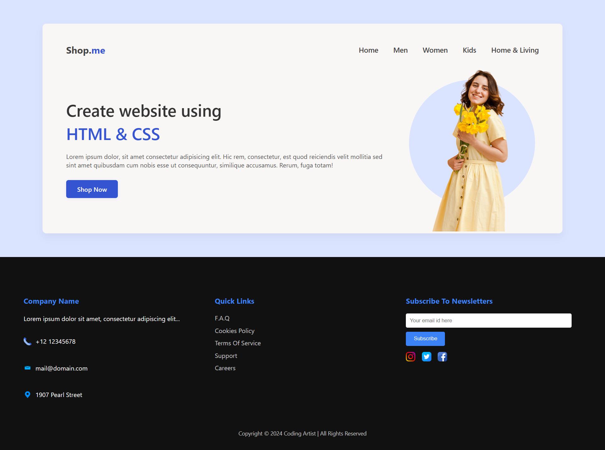

# Shop.me Landing Page

Welcome to the **Shop.me Landing Page**, a simple and clean front-end project built using **HTML** and **CSS**.

This is part of my learning journey in web development, where I practiced layout design, navigation bars, hero sections, and image styling without using any frameworks.

---

## 📌 Features

- 🧭 Responsive Navigation Bar  
- 🖼️ Hero Section with Text and Image  
- 🎯 Call-to-Action Button ("Shop Now")  
- 🧩 Custom Image Styling with CSS  
- 📁 Organized File Structure (HTML, CSS, and Assets)

---

## 🛠️ Tools & Technologies Used

- HTML5
- CSS3
- Visual Studio Code (Editor)
- GitHub (Version Control)

---

## 🧠 What I Learned

- How to structure a web page using semantic HTML
- CSS styling for layouts and alignment
- Flexbox usage for responsive design
- Clean code practices and GitHub project management

---

## 📷 Project Preview

---

## 📂 Folder Structure
📁 assets/
    ├── email.png
    ├── facebook.png
    ├── gps.png
    ├── instagram.png
    ├── phone.png
    ├── preview.png
    ├── smiley-woman-with-flowers.png
    ├── twitter.png

📄 README.md
📄 index.html
📄 style.css

---

## 🙋‍♀️ Created By

**Syeda Sahar Rashid**  
*Aspiring Web And App Developer & Software Engineering Student*

---
